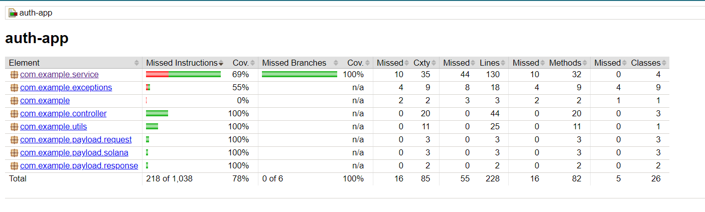
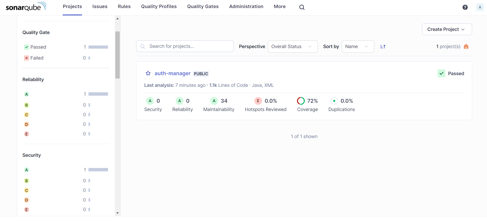
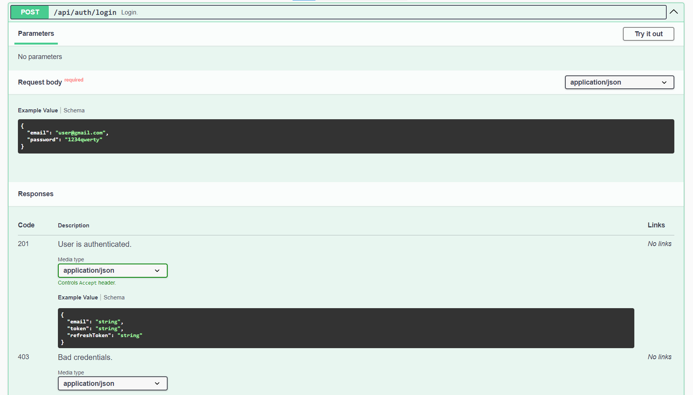

# Authentication Application

### Code Quality

#### Jacoco


#### Sonarqube


#### Swagger
[http://localhost:8080/swagger-ui/index.html](http://localhost:8080/swagger-ui/index.html)




### Tech Stack
1. Java 17
2. Spring Boot 3
3. Spring Security (JWT)
4. Maven
5. Postgres
6. flyway


### Intellij IDEA:

1. Open the project in IntelliJ IDEA.
2. Navigate to the `Application.java` class located in the `src/main/java` directory.
3. Right-click on the `Application.java` file and select "Run Application".

### Terminal:

1. Open cmd or terminal at you project dir
2. Run the following command to build the application:
   ```
   mvn clean install
   ```
3. Then:
   ```
   mvn spring-boot:run
   ```

Access the Application:
- http://localhost:8080

### Docker:

1. **Build the Docker Image:**
  
   ```bash
   docker build -t secure-user-manager .
   ```

2. **Start the Application with Docker Compose:**
   
   ```bash
   docker-compose up
   ```

3. **Access Your Application:**
   ```
   http://localhost:8080
   ```


Developed by Volodymyr
